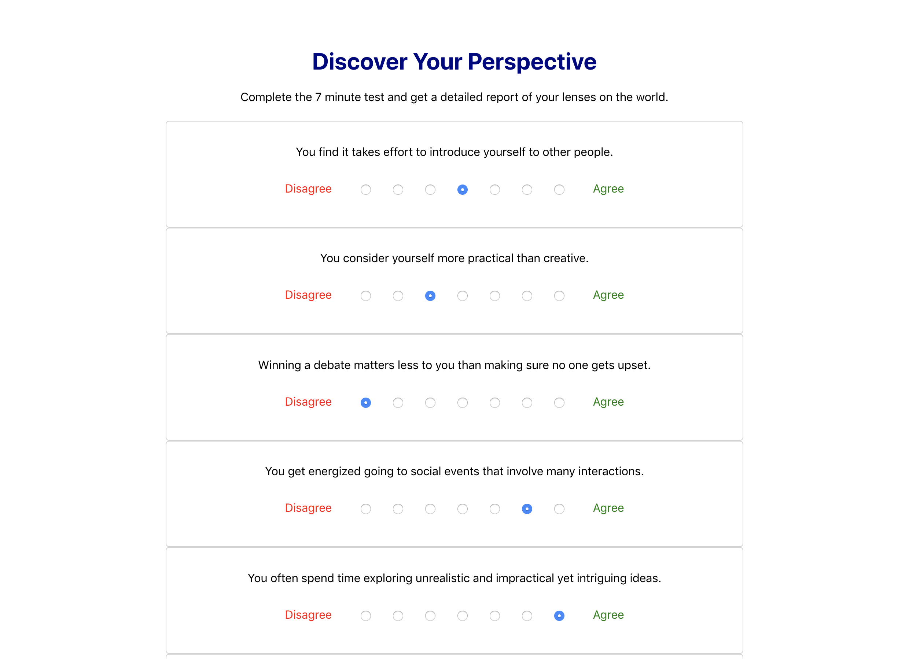

# Myers-Briggs Personality Test

## Discover Your Perspective!

## Getting Started

#### Terminal 1:
- `cd server` to access the backend API.
- `touch .env` and enter your credentials as seen in the .env.example.
- `npm i` to install all dependencies.
- `knex migrate:latest` to set up the schema.
- `knex seed:run` to populate the list of questions.
- `npm start` to start the backend server.

#### Terminal 2:
- `cd client` to access the React application.
- `npm i` to install all dependencies.
- `npm start` to start the app.
- open `http://localhost:3000/` in your browser to start using the app.